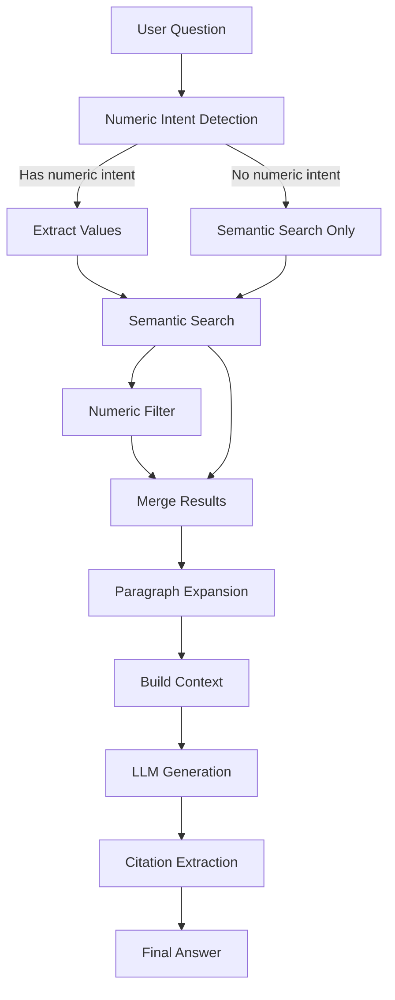

# Dual Retrieval Flow - Technical Deep Dive

## Overview

The dual retrieval system combines semantic search with structured numeric filtering and paragraph expansion to provide accurate, contextually-rich answers.

## Architecture



---

## Step 1: Numeric Intent Detection

### Purpose
Determine if the question requires numeric filtering (years, amounts, dates).

### Implementation

**Patterns Detected:**
- Arabic numerals: `٢٠٢٤`, `٣١`, `٪`
- Western numerals: `2024`, `31`, `%`
- Keywords: سنة، عام، مليون، نسبة، كم، قيمة

**Example:**
```python
question = "كم بلغت الأصول في ٣١ ديسمبر ٢٠٢٤؟"
has_intent, values = detect_numeric_intent(question)
# Returns: (True, ['٢٠٢٤', '٣١'])
```

---

## Step 2: Semantic Search

### Purpose
Find semantically similar units using vector embeddings.

### Process

1. **Generate Query Embedding**
   - Model: BAAI/bge-m3
   - Dimension: 1024
   - Input: Normalized question text

2. **pgvector Similarity Search**
   ```sql
   SELECT *
   FROM information_units
   ORDER BY embedding <=> query_embedding
   LIMIT 10;
   ```

3. **Similarity Threshold**
   - Default: 0.3
   - Units below threshold are discarded

**Example Results:**
```
Unit 1: similarity=0.85, "إجمالي الأصول..."
Unit 2: similarity=0.78, "الأصول المالية..."
Unit 3: similarity=0.65, "استثمارات البنك..."
```

---

## Step 3: Structured Numeric Filter

### Purpose
Filter units containing specific numeric values (when detected).

### Implementation

**JSONB Filtering:**
```sql
SELECT *
FROM information_units
WHERE numeric_data::text LIKE '%٣١ ديسمبر ٢٠٢٤%';
```

**Date Patterns Tried:**
- `٣١ ديسمبر {year}`
- `٣٠ يونيو {year}`
- Raw extracted value

**Example:**
```
Query: "الأصول في ٢٠٢٤"
Filters: ['٣١ ديسمبر ٢٠٢٤', '٣٠ يونيو ٢٠٢٤', '٢٠٢٤']
Result: Units with numeric_data containing these patterns
```

---

## Step 4: Result Merging

### Purpose
Combine semantic and numeric results, removing duplicates.

### Logic

```python
if has_numeric_intent:
    combined = numeric_units + semantic_units
else:
    combined = semantic_units

# Deduplicate by unit_id
unique_units = deduplicate(combined)
```

**Prioritization:**
- Numeric matches: similarity = 1.0 (exact)
- Semantic matches: similarity = 0.3-1.0

---

## Step 5: Paragraph Expansion

### Purpose
Retrieve complete paragraphs for better context.

### Process

1. **Extract (page, paragraph) Pairs**
   ```python
   paragraphs = {(3, 2), (3, 5), (4, 1)}
   ```

2. **Fetch All Units in These Paragraphs**
   ```sql
   SELECT *
   FROM information_units
   WHERE page_number = 3 AND paragraph_number = 2
   ORDER BY sentence_index;
   ```

3. **Deduplicate and Sort**
   - Remove duplicate unit_ids
   - Sort by (page, paragraph, sentence)

**Example:**
```
Before: 3 units (from sentences 2, 5, 8)
After: 10 units (complete paragraphs containing those sentences)
```

---

## Step 6: Context Building

### Purpose
Format retrieved units into structured context for LLM.

### Format

```
[صفحة 3]
إجمالي الأصول في ٣١ ديسمبر ٢٠٢٤ بلغ ٨٬١٣٧٬٣٩٤ مليون جنيه
  البيانات الرقمية: {"٣١ ديسمبر ٢٠٢٤": "٨٬١٣٧٬٣٩٤", ...}

[صفحة 4]
تفاصيل الاستثمارات المالية...
```

**Components:**
- Page headers
- Raw text from units
- Numeric data (if available)

---

## Step 7: LLM Generation

### System Prompt

```
أنت محلل مالي محترف...

قواعد صارمة:
١. استخدم فقط المعلومات من السياق
٢. لا تخترع أرقام
٣. إذا المعلومة غير موجودة، قل ذلك بوضوح
٤. اذكر رقم الصفحة
٥. استخدم لغة عربية رسمية
```

### User Prompt

```
السياق: {context}
السؤال: {question}
الإجابة (مع ذكر رقم الصفحة):
```

### API Call

```python
response = groq_client.chat.completions.create(
    model="deepseek-r1-distill-llama-70b",
    messages=[system_prompt, user_prompt],
    temperature=0.1,
    max_tokens=1000
)
```

---

## Step 8: Citation Extraction

### Purpose
Extract page references and build citation list.

### Logic

1. **Find Page Mentions in Answer**
   - Regex: `صفحة\s*[٠-٩\d]+`
   - Extract page numbers

2. **Map to Retrieved Units**
   - For each mentioned page
   - Find best matching unit (highest similarity or with numeric_data)

3. **Build Citation Objects**
   ```python
   Citation(
       page=3,
       text="إجمالي الأصول..."[:200]
   )
   ```

---

## Example Flow

### Input
```
Question: "كم بلغت الأصول في ٢٠٢٤؟"
```

### Step-by-Step

1. **Numeric Intent**: ✓ Detected `٢٠٢٤`
2. **Semantic Search**: Found 8 units about "أصول"
3. **Numeric Filter**: Found 12 units with "٢٠٢٤" in numeric_data
4. **Merge**: 15 unique units
5. **Expansion**: Expanded to 28 units (full paragraphs)
6. **Context**: Built formatted string (1,234 chars)
7. **LLM**: Generated answer
8. **Citations**: 2 citations (pages 3, 4)

### Output
```json
{
  "answer": "إجمالي الأصول في ٣١ ديسمبر ٢٠٢٤ بلغ ٨٬١٣٧٬٣٩٤ مليون جنيه (صفحة ٣)",
  "citations": [
    {"page": 3, "text": "إجمالي الأصول..."},
    {"page": 4, "text": "تفاصيل الأصول..."}
  ]
}
```

---

## Performance Characteristics

| Step | Time (avg) | Notes |
|------|-----------|-------|
| Numeric detection | <1ms | Regex patterns |
| Semantic search | ~50ms | HNSW index |
| Numeric filter | ~20ms | GIN JSONB index |
| Expansion | ~100ms | B-tree indexes |
| Context building | <5ms | String formatting |
| LLM generation | 1-4s | Groq API latency |
| Citation extract | <10ms | Regex + mapping |
| **Total** | **2-5s** | End-to-end |

---

## Configuration Options

### Retrieval Settings

| Parameter | Default | Description |
|-----------|---------|-------------|
| `TOP_K_SEMANTIC` | 10 | Max semantic results |
| `SIMILARITY_THRESHOLD` | 0.3 | Min similarity score |
| `ENABLE_PARAGRAPH_EXPANSION` | True | Toggle expansion |

### LLM Settings

| Parameter | Default | Description |
|-----------|---------|-------------|
| `GROQ_MODEL` | deepseek-r1-distill-llama-70b | LLM model |
| `GROQ_TEMPERATURE` | 0.1 | Creativity (low=factual) |
| `GROQ_MAX_TOKENS` | 1000 | Max answer length |

---

## Edge Cases

### 1. No Semantic Matches
- Threshold too high
- **Solution**: Lower `SIMILARITY_THRESHOLD` or improve embeddings

### 2. Numeric Value Not Found
- Date format mismatch
- **Solution**: Try multiple date patterns

### 3. Too Much Context
- Expansion retrieves too many units
- **Solution**: Limit expansion or summarize

### 4. LLM Hallucinates
- Ignores "use only context" directive
- **Solution**: Strengthen system prompt, lower temperature

---

## Future Enhancements

- [ ] Re-ranking after retrieval
- [ ] Multi-hop reasoning
- [ ] Source tracking per sentence
- [ ] Confidence scores
- [ ] Query decomposition for complex questions
